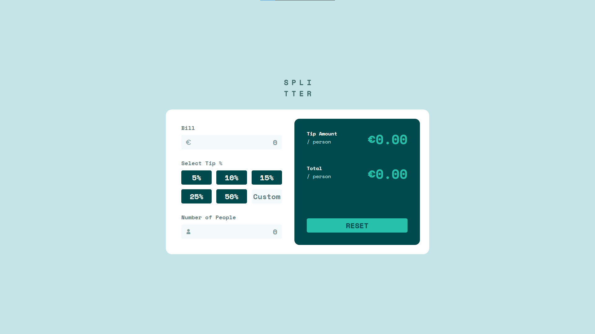

# Frontend Mentor - Tip calculator app solution

This is a solution to the [Tip calculator app challenge on Frontend Mentor](https://www.frontendmentor.io/challenges/tip-calculator-app-ugJNGbJUX).

## Table of contents

- [Overview](#overview)
  - [The challenge](#the-challenge)
  - [Screenshot](#screenshot)
  - [Links](#links)
- [My process](#my-process)
  - [Built with](#built-with)
- [Author](#author)

## Overview

### The challenge

Users should be able to:

- View the optimal layout for the app depending on their device's screen size
- See hover states for all interactive elements on the page
- Calculate the correct tip and total cost of the bill per person

### Screenshot

### Links

- Solution URL: [Solution here](https://github.com/Ximoromero6/tip-challange)
- Live Site URL: [Live site URL here](https://ximoromero6.github.io/tip-challange/)

## My process

### Built with

- HTML5 markup
- SCSS
- Vanilla Javascript

## Author

- Website - [ximoromero.es](https://www.ximoromero.es)
- Frontend Mentor - [@Ximoromero6](https://www.frontendmentor.io/ximoromero6)
- Instagram - [@Ximoromero5](https://www.instagram.com/Ximoromero5)
